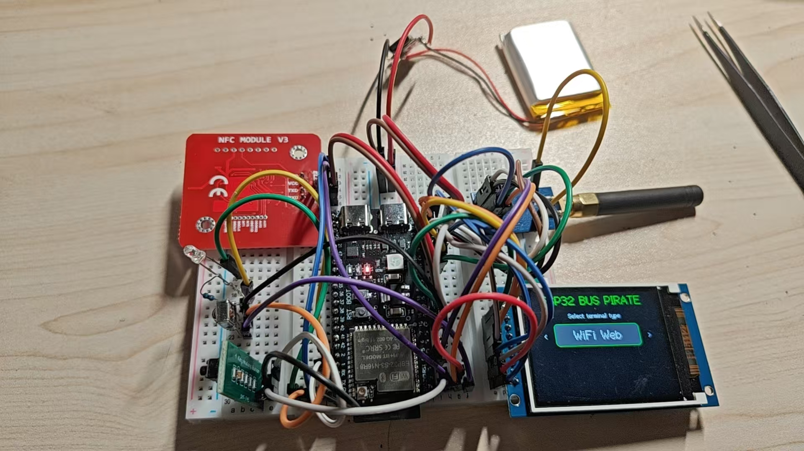

# ESP32 Bus Pirate Custom Fork

这个仓库不是原版说明文档，而是当前这套自定义硬件的适配说明。

适配目标硬件：

- `ESP32-S3 N16R8`
- `ST7789 240x320 SPI` 屏幕
- `AO` 四键 AD 按键模块
- `PN532` RFID 模块
- `CC1101` SubGHz 模块
- `VS1838B` 红外接收头
- 红外发射管

## 当前硬件接线

### ST7789

- `SCK = GPIO12`
- `MOSI = GPIO11`
- `CS = GPIO10`
- `DC = GPIO14`
- `RST = GPIO15`
- `BL = GPIO16`

### AD 按键

- `AO = GPIO1`
- `K1 -> LEFT`
- `K2 -> RIGHT`
- `K3 -> OK`
- `K4 -> DOWN`

### PN532

- `SDA = GPIO8`
- `SCL = GPIO18`

### CC1101

- `CSN = GPIO9`
- `SCK = GPIO12`
- `MOSI = GPIO11`
- `MISO = GPIO13`
- `GDO0 = GPIO4`

### 红外

- `IR TX = GPIO2`
- `IR RX = GPIO5`

## 相对原版的主要改动

### 1. 新增 S3 外接屏板型

为 `ESP32-S3 N16R8 + 外接 ST7789` 增加了专用板型配置：

- `DEVICE_S3DEVKIT_ST7789`
- 屏幕参数和引脚宏写入 `platformio.ini`

### 2. 新增 ST7789 视图

新增文件：

- `src/Views/S3DevKitSt7789DeviceView.h`
- `src/Views/S3DevKitSt7789DeviceView.cpp`

作用：

- 外接屏启动显示
- 模式页面显示
- 波形和瀑布图显示
- 避免重复初始化导致的屏幕异常

### 3. 新增 AO 四键输入

新增文件：

- `src/Inputs/S3DevKitAdInput.h`
- `src/Inputs/S3DevKitAdInput.cpp`

作用：

- 使用 `GPIO1` 读取 AD 按键模块
- 适配 `LEFT / RIGHT / OK / DOWN`
- 为当前四键模块加入 ADC 阈值

### 4. 调整带屏交互流程

修改了带屏设备的配置和输入路径，保证当前硬件可以直接使用屏幕和按键：

- `src/main.cpp`
- `src/Config/TerminalTypeConfigurator.cpp`
- `src/Config/WifiTypeConfigurator.cpp`
- `src/Vendors/TdisplayWifiSetup.cpp`
- `src/Vendors/TdisplayWifiSetup.h`

作用：

- 支持屏幕上的终端类型选择
- 支持按键操作 Wi-Fi 选择界面
- 修复 Wi-Fi 界面旋转方向
- 将界面提示文字改成适配 `K1-K4`

### 5. 修复 CC1101 / SUBGHZ 初始化

修改文件：

- `src/Controllers/SubGhzController.cpp`
- `src/Controllers/SubGhzController.h`
- `src/Services/SubGhzService.cpp`
- `src/Services/SubGhzService.h`
- `src/Views/NoScreenDeviceView.cpp`
- `src/Views/NoScreenDeviceView.h`
- `lib/SmartRC-CC1101-Driver-Lib/ELECHOUSE_CC1101_SRC_DRV.cpp`

作用：

- 修复进入 `SUBGHZ` 后配置引脚时卡死
- 去掉重复配置流程
- 保留并修正 `provided SPI instance` 用法
- 修复 `ESP32-S3` 上 `CC1101` 的 SPI / Reset 初始化问题

### 6. 本地 Web Flasher 改为当前固件

修改文件：

- `webflasher/manifests/s3devkitn16r8.json`

作用：

- 指向当前 fork 的自定义 merged 固件
- 用于本地网页刷机

## docs 目录内容

`docs` 目录保存的是这套硬件相关的资料和参考文件。

### `docs/esp32-s3-n16-r8`

- `ESP32-S3 N16R8` 开发板实物图
- `ESP32-S3` datasheet
- 开发板原理图

### `docs/st7789`

- `ST7789` 屏幕实物图
- 屏幕规格书
- 屏幕驱动相关参考资料
- 原厂附带的参考代码

### `docs/CC1101`

- `CC1101` 模块实物图
- 引脚定义和模块资料图

### `docs/PN532-RFID`

- `PN532` 模块实物图
- 模块接口资料图

### `docs/power`

- 锂电池充放电模块实物图
- 供电接线参考图

## 编译环境

当前使用环境：

- `platformio` environment: `s3-devkit-n16-r8`

## 说明

- 这份 fork 说明只描述当前这套硬件适配
- 使用方法、接线和调试步骤见根目录 userguide.pdf
